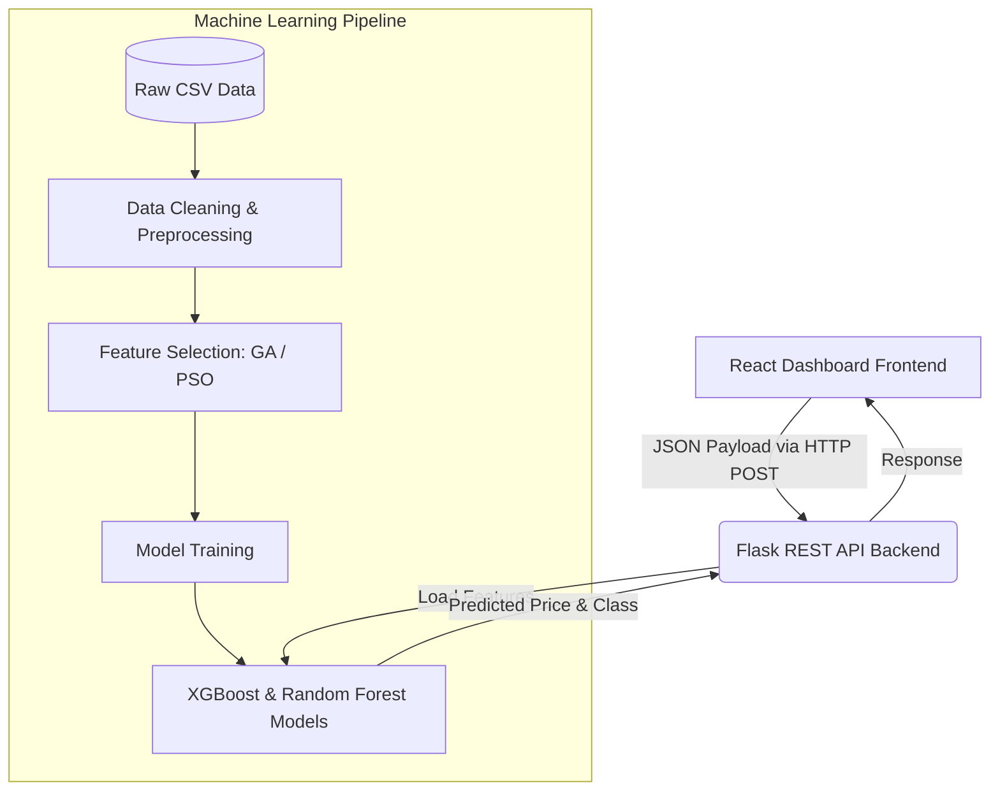

# 💎 Gemstone Price Prediction Engine
**Nature-Inspired Algorithms (NIA) for Feature Selection & Optimization**


This repository houses a comprehensive end-to-end Machine Learning pipeline utilizing metaheuristic optimization techniques—namely **Genetic Algorithms (GA)** and **Particle Swarm Optimization (PSO)**—for feature selection. Combined with advanced regression models (**Random Forest** and **XGBoost**), this project aims to highly optimize prediction accuracy and model efficiency for estimating gemstone market prices.

---

## 👥 Team & Individual Contributions

This project was developed collaboratively with distinct responsibilities to compare different Nature-Inspired Algorithms (NIA) and Machine Learning techniques. 

| Team Member | Student ID | Core Responsibilities & Contributions |
| :--- | :--- | :--- |
| **Buddhika Janadari** | `ITBIN-2313-0043` | <ul><li>**Dataset:** Cubic Zirconia (`data/raw/cubic_zirconia.csv`)</li><li>**Modeling:** XGBoost Baseline & Evaluation</li><li>**Optimization:** Feature Selection using Particle Swarm Optimization (PSO)</li><li>**Pipeline:** `buddhika-pso` Branch Management</li></ul> |
| **Sajini Sawindya** | `ITBIN-2313-0064` | <ul><li>**Dataset:** Diamonds (`data/raw/diamonds.csv`)</li><li>**Modeling:** Random Forest Baseline & Evaluation</li><li>**Optimization:** Feature Selection using Genetic Algorithm (GA)</li><li>**Pipeline:** `sajini-ga` Branch Management</li></ul> |

**Module Lecturer:** `[Lecturer Name]`

---

## 🏗️ Architecture & Tech Stack

### 🗺️ System Architecture Diagram


### 🧠 Machine Learning Core
- **Algorithms:** Random Forest Regressor, XGBoost
- **Optimization (NIA):** Genetic Algorithm (GA), Particle Swarm Optimization (PSO)
- **Data Engineering:** Pandas, NumPy
- **Libraries:** Scikit-learn, XGBoost, DEAP (for GA), PySwarms (for PSO)

### ⚙️ Backend (API)
- **Framework:** Python Flask, Flask-CORS
- **Role:** Serves the optimized models and exposes a RESTful `/predict` endpoint for real-time, low-latency inference.

### 🎨 Frontend (Dashboard)
- **Framework:** React 19, Vite, Tailwind CSS 4.0, Recharts, Framer Motion
- **Role:** Provides a sleek, modern, interactive UI to input gemstone characteristics, dynamically adjust features, and view predicted prices and asset classes in real-time.

---

## 📂 Project Repository Structure

```text
gemstone-NIA-project/
├── backend/                  # Flask API for live model inference
│   └── app.py                # Main Flask application
├── dashboard-demo/           # React + Vite frontend for the UI dashboard
│   ├── src/                  # React components and pages
│   └── package.json          # Node dependencies
├── data/                     # Raw and preprocessed dataset files (git-ignored)
├── models/                   # Saved trained model artifacts (.json, .joblib)
├── notebooks/                # Jupyter Notebooks for exploration and prototyping
│   ├── sajini/               # GA & RF experiments
│   └── buddhika/             # PSO & XGBoost experiments
├── report/                   # Final project report drafts and references
├── results/                  # Generated evaluation metrics, plots, and saved models
├── src/                      # Reusable Python scripts and modules
│   ├── preprocess_diamonds.py        # Data cleaning for diamonds
│   ├── preprocess_gemstone.py        # Data cleaning for cubic zirconia
│   ├── baseline_rf_diamonds.py       # RF Baseline training
│   ├── baseline_xgb_gemstone.py      # XGBoost Baseline training
│   ├── ga_feature_selection.py       # GA implementation
│   ├── pso_feature_selection.py      # PSO implementation
│   ├── train_ga_models.py            # Train models with GA selected features
│   ├── train_pso_models.py           # Train models with PSO selected features
│   └── final_evaluation.py           # Evaluation script
├── start.bat                 # 1-Click Startup Script (Windows)
├── start.sh                  # 1-Click Startup Script (Unix/Mac)
├── config.py                 # Central configuration for directory paths and parameters
├── requirements.txt          # Python dependencies
└── README.md                 # Project documentation
```

---

## 🚀 Setup Instructions

### 1. Clone the repository
```bash
git clone <repository_url>
cd gemstone-NIA-project
```

### 2. Check out your respective branch
*   **For Sajini:** `git checkout sajini-ga`
*   **For Buddhika:** `git checkout buddhika-pso`

### 3. Place Data Files
Ensure your datasets are placed inside the `data/raw/` folder before running scripts:
- **Sajini:** `data/raw/diamonds.csv`
- **Buddhika:** `data/raw/cubic_zirconia.csv`

---

## 💻 Running the Application (Dashboard & API)

You can instantly launch both the Python backend and the React frontend using the provided automated startup scripts!

**For Windows Users:**
Simply double click `start.bat` in your file explorer, or run it in your terminal:
```cmd
.\start.bat
```

**For macOS/Linux Users:**
```bash
chmod +x start.sh
./start.sh
```

> **Note:** The script will automatically create a Python virtual environment, install all required pip and npm dependencies, and launch the servers. The Dashboard will be accessible at `http://localhost:5173`.

### 🐳 Running with Docker (Recommended)

If you have Docker installed, you can completely bypass manual setup and easily spin up the entire application using Docker Compose!

```bash
# Build and start the containers in the background
docker-compose up -d --build
```
* **Frontend Dashboard:** Available at `http://localhost:5174`
* **Backend API:** Available at `http://localhost:5000`

To stop the containers later, simply run:
```bash
docker-compose down
```

---

## 🔬 Running the ML Pipeline Manually

If you wish to train the models or run the feature selection algorithms manually, execute the scripts sequentially from the root directory:

**1. Data Preprocessing:**
```bash
python src/preprocess_diamonds.py
python src/preprocess_gemstone.py
```

**2. Baseline Model Training:**
```bash
python src/baseline_rf_diamonds.py
python src/baseline_xgb_gemstone.py
```

**3. Nature-Inspired Feature Selection:**
```bash
python src/ga_feature_selection.py
python src/pso_feature_selection.py
```

**4. Final Model Training & Evaluation:**
```bash
python src/train_ga_models.py
python src/train_pso_models.py
python src/final_evaluation.py
```

---

## 📊 Evaluation & Results
All generated plots, feature selection logs, and evaluation metrics (MSE, RMSE, R2 Score, MAE) are automatically serialized and saved in the `results/` directory for comparative analysis. Trained models are securely stored in the `models/` directory for seamless integration with the backend API.
